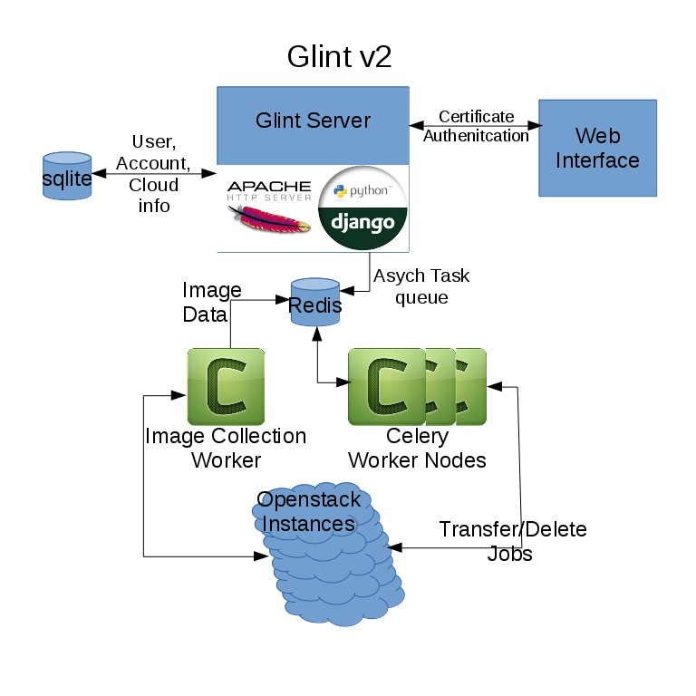

# Glint v2

## Overview
Glint Version 2 aims to replicate the functionality of the original Glint
while simplifying it by decoupling it from an Openstack instance.

The basic premise is to use grid certificates to authenticate users and 
allow them to transfer virtual machine images between openstack project
repositories. Glint v2 accomplishes this by running a Django webserver
using apache+mod_ssl to authenticate user certificates and provide a
web interface to expose the glint services.

Authenticated users are able to use the interface to add openstack instances
to glint which in turn populates a matrix of virtual machine images (VMs) and
openstack projects. Users are then able to use the check boxes in the matrix
to queue transfers or deletions of VMs.

## Deployment
Deployment of glint is mostly automated using an [ansible playbook](https://github.com/hep-gc/ansible-systems/tree/glintv2/heprc/glintv2).
However there is some manual setup due to the confidentiality of the server
certificates. The certificates should be placed at the paths matching the
ssl.conf and glintv2.conf files (default: /etc/pki/tls/certs/ for the server certs and
/etc/glintv2/ for the CA Bundle).
Next the django server needs a secret key to use for secure communication.
A key generation script is included with glint and can be found at
/opt/Glintv2/config/key_gen.py after the ansible playbook has been run.
Simply run `python key_gen.py` to generate a key and copy it into
/opt/Glintv2/glintv2/settings.py.
Finally we need to make sure the database has been configured and the easiest
way to make sure the tables are up to date is to use the django management tool
by running the following commands:
`python /opt/Glintv2/manage.py makemigrations`
`python /opt/Glintv2/manage.py migrate`

At this point glint should be ready to run:
* Make sure Redis has been started: service redis start
* Make sure Celery has been started: service celery start
* Finally start the webserver: service httpd start

Apache should run but you'll notice you are unable to access the glint WebUI.
This is due to the following reasons:
* You're browser does not have a valid Grid certificate 
* You've yet to be added as a glint user.

To grant yourself initial access to the system you will need to modify a
database entry (this will eventually be automated by a script).
Run the following commands to gain access to the django admin page:
`sqlite3 db.sqlite3 "Update auth_user SET is_superuser='1' where username='**CERTIFICATE COMMON NAME**'"`
`sqlite3 db.sqlite3 "Update auth_user SET is_staff='1' where username='**CERTIFICATE COMMON NAME**'"`

Make sure the username matches the common name of your Grid certificate.
Once this is done you will be an admin user capable of adding Glint Users.
However, you still need to add youself as a Glint User before you can use
the webUI for user and account management. This can be accomplished through
the django admin page at:
https://**SERVER_IP**/admin

Click "Glint_users" under the Glintwebui heading and fill out the form and save.
With this you will finally have full access to glint and will be able to manage
users and accounts through the webui without the need of the django admin page.
Simply navigate to the IP of the server and you should be able to begin using
Glintv2.